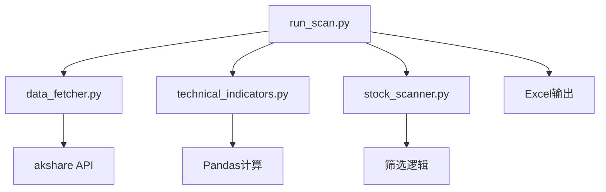

# 技术设计: 初始版本

## 技术方案
### 核心技术
- Python 3.x
- akshare（数据获取）
- pandas（数据处理）
- openpyxl（Excel输出）

### 实现要点
1. 使用akshare API获取实时股票数据
2. 实现技术指标计算函数
3. 设计筛选逻辑和信号判断
4. 实现命令行接口
5. 生成Excel报告

## 架构设计

## API设计
### 命令行接口
- --mode: 扫描模式（test/full/custom）
- --n: 测试模式扫描数量
- --min-signals: 最少信号数量
- --stocks: 自定义股票列表

## 数据模型
### 输出数据结构
- 股票代码、名称、日期、收盘价
- 涨跌幅、成交量、信号数
- 各项技术指标信号

## 安全与性能
- **安全:** 无敏感信息处理
- **性能:** 网络请求间隔0.1秒，避免API限制

## 测试与部署
- 提供快速测试脚本（quick_test.py）
- 支持Windows和Linux系统