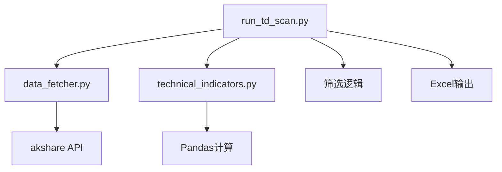

# 技术设计: TD序列扫描器

## 技术方案
### 核心技术
- Python 3.x
- akshare（数据获取）
- pandas（数据处理）
- openpyxl（Excel输出）

### 实现要点
1. 实现TD序列计算函数
2. 新增run_td_scan.py脚本
3. 支持多周期分析（日K、周K、月K）
4. 实现TD序列筛选逻辑
5. 优化数据获取和处理

## 架构设计

## API设计
### 命令行接口
- --mode: 扫描模式（test/full/custom）
- --n: 测试模式扫描数量
- --min-td: 最小TD计数（7/8/9）
- --periods: 分析周期（daily/weekly/monthly）
- --stocks: 自定义股票列表

## 数据模型
### 输出数据结构
- 股票代码、名称、日期、收盘价
- 各周期TD计数
- TD序列信号（7底、8底、9底）
- 最大TD计数

## 安全与性能
- **安全:** 无敏感信息处理
- **性能:** 网络请求间隔0.1秒，避免API限制

## 测试与部署
- 提供测试脚本（test_td.py）
- 支持Windows和Linux系统