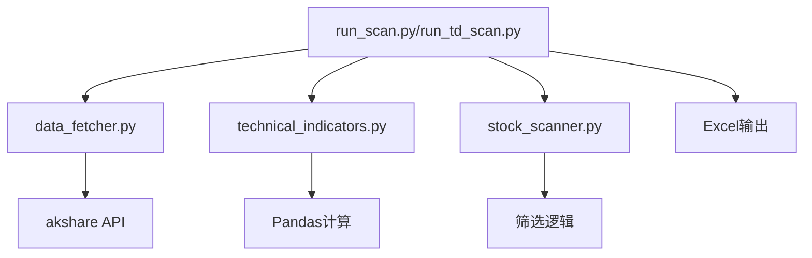
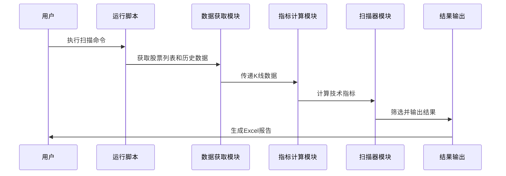

# 架构设计

## 总体架构

## 技术栈
- **后端:** Python 3.x
- **数据获取:** akshare（开源金融数据接口库）
- **数据处理:** pandas（数据分析库）
- **Excel输出:** openpyxl（Excel文件处理库）
- **命令行解析:** argparse（Python标准库）

## 核心流程

## 重大架构决策
完整的ADR存储在各变更的how.md中，本章节提供索引。

| adr_id | title | date | status | affected_modules | details |
|--------|-------|------|--------|------------------|---------|